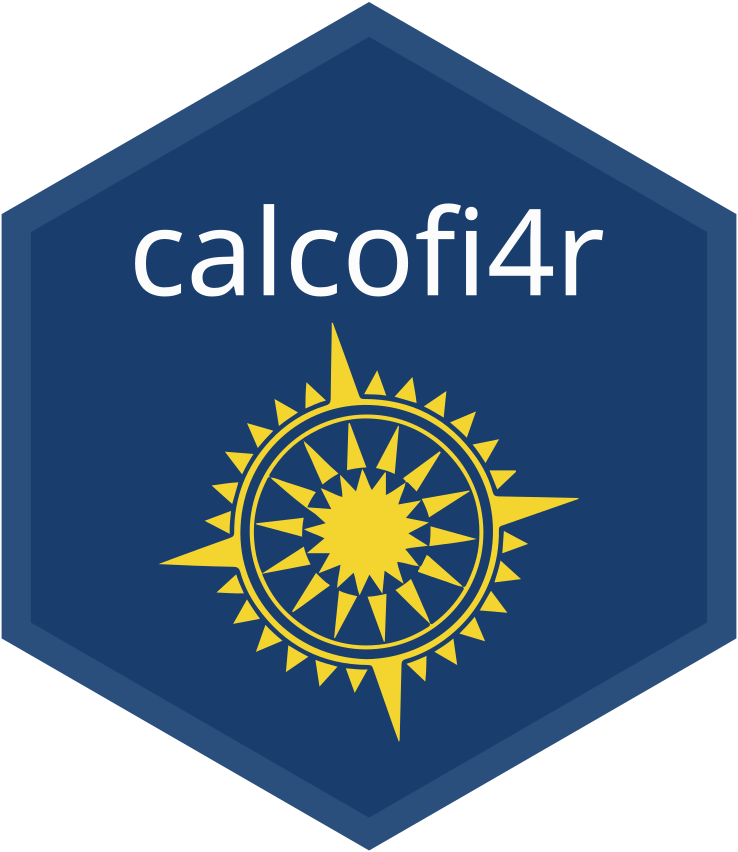

<!-- README.md is knit from README.Rmd: every chunk below is EXECUTED against the
     promoted release (tests/testthat/test-readme.R), so edit the .Rmd and re-knit.
     A chunk that must not run (install steps) says `eval = FALSE` itself. -->

# calcofi4r 

R package for accessing and visualizing CalCOFI data: the public, versioned database
releases (DuckDB over Parquet on Google Cloud Storage, no account needed) and the CTD
team's PostgreSQL working database (account required). The Python sibling is
[calcofi4py](https://calcofi.io/calcofi4py/) — same verbs, same defaults.

```{r knitr, include = FALSE}
knitr::opts_chunk$set(
  collapse = TRUE,
  warning  = FALSE,
  message  = FALSE,
  error    = FALSE,   # a failing chunk fails the knit — and the release gate
  comment  = "#>",
  fig.path = "man/figures/")
options(width = 100, pillar.min_title_chars = 8)
```

**These examples are tests.** `tests/testthat/test-readme.R` knits this file against the
promoted release, and the CalCOFI database release pipeline
([`test_release.qmd`](https://github.com/CalCOFI/workflows/blob/main/test_release.qmd))
knits it against every new release *before* promoting it — so a column the release
renames fails the release, not you. The outputs below are from the release named in
[Versions](#versions), with calcofi4r `r as.character(packageVersion("calcofi4r"))`.

## Install

This package lives on GitHub, not CRAN:

```{r install, eval = FALSE}
remotes::install_github("calcofi/calcofi4r")
```

### System requirements

`calcofi4r` pulls in `sf`, and `sf` pulls in [`s2`](https://r-spatial.github.io/s2/),
which is C++ and must compile. CRAN publishes no macOS arm64 binaries for R 4.6 yet, so on
Apple Silicon that compile is not optional and it needs **`cmake`**:

```sh
brew install cmake
```

`brew install abseil` does *not* substitute for this, despite what s2's own error message
suggests. Its `configure` defaults `S2_FORCE_BUNDLED_ABSEIL=true` and so always builds its
vendored copy of Abseil with cmake, never consulting `pkg-config` for a system one.

To skip the compile altogether, point R at Posit Package Manager, which serves prebuilt
macOS arm64 and Linux binaries for R 4.6. Put this in your `~/.Rprofile`:

```{r p3m, eval = FALSE}
options(repos = c(P3M = "https://packagemanager.posit.co/cran/latest"))
```

## The public database releases (no account needed)

Immutable, versioned Parquet on a public bucket; DuckDB reads only what a query touches,
straight over HTTPS. `cc_get_db()` registers every release table as a view, so you query
by bare table name:

```{r connect}
library(calcofi4r)
library(dplyr)

con <- cc_get_db()                       # latest release, every table as a view
DBI::dbListTables(con)

# CTD casts per year: sample is one row per sampling event; datetime is UTC
DBI::dbGetQuery(con, "
  SELECT date_trunc('year', s.datetime) AS year, count(*) AS casts
  FROM sample s WHERE s.dataset_key = 'calcofi_ctd-cast'
  GROUP BY 1 ORDER BY 1 DESC LIMIT 5")

# one-shot, without keeping a connection
cc_query("SELECT dataset_key, count(*) AS n FROM obs_env GROUP BY 1 ORDER BY 2 DESC")

# lazy dbplyr over a view
tbl(con, "taxon") |>
  filter(scientific_name %in% c("Sardinops sagax", "Engraulis mordax")) |>
  select(taxon_key, scientific_name, common_name) |>
  collect()
```

Every dataset projects into one small **core** family — `sample` (the event: cast, tow,
net, bottle) and the observation pair `obs_bio` / `obs_env` (one scalar per row; `obs` is
a view over both) — so a query written against ichthyoplankton works unchanged against
CTD, zooplankton or seabirds. To see what's in each table first: the
[Schema explorer](https://calcofi.io/db-schema/), or from R:

```{r describe}
cc_describe_table("sample", con = con)   # columns, units, descriptions from metadata.json
cc_list_measurement_types(con = con) |> head(8)
```

### Read with convenience functions

```{r read}
# taxonomy: one row per taxon, keyed worms:<id> or itis:<id>
cc_read_taxon(scientific_name == "Engraulis mordax")

# occurrences of one taxon in one dataset, lazily (collect = FALSE)
anchovy <- cc_read_obs(
  taxon_key == "worms:272286", realm = "bio", datasets = "swfsc_ichthyo", collect = FALSE)
anchovy |> count(life_stage, measurement_type) |> collect()

# sampling events, filtered by core columns
cc_read_sample(datasets = "calcofi_bottle", sample_types = "cast") |>
  select(sample_key, cruise_key, site_key, datetime, latitude, longitude) |>
  head(3)
```

### Quality flags

`measurement_qual` is each dataset's *own* code set (bottle/CTD `8` = suspect, `9` =
missing/bad; DIC WOCE 3/4/9). A flagged value is still a row — filter it:

```{r qual}
cc_qual_ok_sql("o")                      # the predicate, for obs / obs_env / sample_measurement

DBI::dbGetQuery(con, glue::glue("
  SELECT count(*) AS n_ok
  FROM obs_env o
  WHERE o.dataset_key = 'calcofi_bottle' AND o.measurement_type = 'oxygen_ml_l'
    AND {cc_qual_ok_sql('o')}"))
```

### Match biology to environment

The question CalCOFI exists to answer: what water were the larvae in? One call joins
ichthyoplankton tows to the nearest CTD-bottle measurement, and `return_sql = TRUE` hands
back the exact query so anyone can re-run it in DuckDB (R, Python, the CLI):

```{r match}
d <- cc_match_ichthyo_by_name(
  scientific_name = "Sardinops sagax",
  env_var         = "temperature",
  date_min        = "2018-01-01",
  date_max        = "2018-12-31",
  relax_matching  = TRUE)
dim(d)
d |> select(bio_datetime, bio_lat, bio_lon, bio_value, env_value, dist_km, time_diff_hr) |> head(3)
```

See the [bio–env matching article](https://calcofi.io/calcofi4r/articles/bio-env-matching.html)
for the column contract and `cc_match_bio_env()` for your own subqueries.

### Versions

Releases are immutable, so pin one for a reproducible analysis:

```{r versions}
cc_list_versions() |> select(version, release_date, tables, total_rows, doi, is_latest) |> head(3)

cc_latest_version()                      # what "latest" resolves to right now — record it
con_pinned <- cc_get_db(version = "v2026.08.25")   # a consolidated release stays readable
DBI::dbGetQuery(con_pinned, "SELECT count(*) AS n FROM cruise")

cc_db_info()$version                     # catalog.json for a version
cat(substr(cc_release_notes(), 1, 400))  # its RELEASE_NOTES.md
```

### Cite

```{r cite}
cites <- cc_cite()                       # the release, then every dataset it carries
length(cites)
cat(cites[1:2], sep = "\n\n")
```

## The CTD team's PostgreSQL working database (account required)

Private, multi-user, reached over SSH — see
[Server Access](https://calcofi.io/docs/server-access.html) for the account, the
`~/.ssh/config` alias `calcofi`, and the `~/.pgpass` file (your password lives there
and in no script, ever). `cc_pg_connect(tunnel = TRUE)` opens the tunnel for you;
`cc_pg_attach(con)` ATTACHes PostgreSQL to a `cc_get_db()` DuckDB connection as the
catalog `pg`, so one query can join the public release to the team's working state.
See `?cc_pg_connect`.

## Package data

Small lookup and example datasets ship with the package:

```{r data}
cc_grid          # CalCOFI sampling grid (sf polygons)
cc_grid_zones    # zones aggregated by station pattern
head(cc_places)  # geographic places
```

## Data architecture

Since the v2026.09 releases each table's bytes are **content-addressed** objects that the
release catalog points at, so a table unchanged between releases is stored, and fetched,
once:

```
gs://calcofi-db/ducklake/
├── releases/
│   ├── latest.txt            → v2026.09.06 (promoted only after test_release.qmd passes)
│   ├── versions.json
│   ├── RELEASES.md           # the database's NEWS file
│   └── v2026.09.06/
│       ├── catalog.json      # tables, row counts, objects[] (path + sha256), views
│       ├── metadata.json     # table/column descriptions, units, datasets
│       ├── relationships.json
│       ├── datasets.json, taxa.json, integrity.json
│       └── RELEASE_NOTES.md
└── tables/{table}/{hash}/…   # the parquet, one immutable object per table (or partition)
```

Never build a `releases/{v}/parquet/` path by hand: `cc_catalog()` →
`cc_release_sources()` → `cc_read_parquet_sql()` is how every table here is resolved, and
you can hand that SQL fragment to any DuckDB. Details:
[Data Access](https://calcofi.io/docs/data-access.html).

```{r sources}
cat_ <- cc_catalog("latest")
src  <- cc_release_sources(cat_, "obs_env")
length(src$urls)                         # one https URL per partition
substr(cc_read_parquet_sql(src), 1, 120) # read_parquet([...], hive_partitioning = true)
```

```{r disconnect, include = FALSE}
DBI::dbDisconnect(con, shutdown = TRUE)
DBI::dbDisconnect(con_pinned, shutdown = TRUE)
```

## Documentation

- [Get Started](https://calcofi.io/calcofi4r/articles/calcofi4r.html) and the other articles
- [Function Reference](https://calcofi.io/calcofi4r/reference/)
- [**CalCOFI Docs**](https://calcofi.io/docs/) — data access, helpers, portals, API

## See also

- [**CalCOFI Explorer**](https://calcofi.io/explore/) — the browser app over the same release
- [**CalCOFI Schema**](https://calcofi.io/db-schema/) — per-release ERD, tables, columns (units + descriptions), datasets, and measurement-type registry
- [**CalCOFI Query**](https://calcofi.io/db-query/) — browser-only DuckDB-WASM playground against the public release Parquet

## Code of Conduct

This is an open-source project so your input is greatly welcomed! Please note that the `calcofi4r` project is released with a [Contributor Code of Conduct](https://calcofi.github.io/calcofi4r/CODE_OF_CONDUCT.html). By contributing to this project, you agree to abide by its terms.
