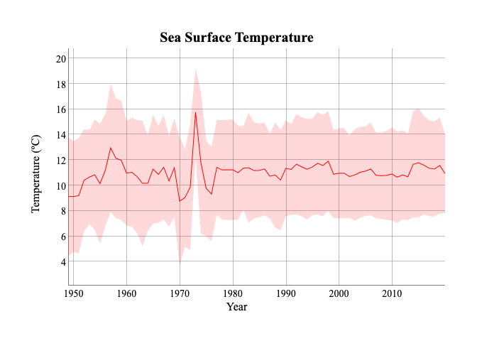
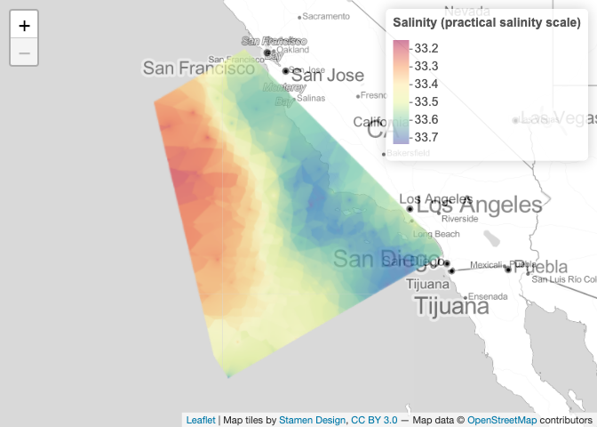

calcofi4r
================

R package of helper functions for reading and visualizing data from the
CalCOFI API at [api.calcofi.io](https://api.calcofi.io).

## Install R package

``` r
# install.packages("devtools")
remotes::install_github("calcofi/calcofi4r")
```

## Plot time series of an oceanographic variable

``` r
library(calcofi4r)

# get variables
(v <- get_variables())
#> Rows: 7 Columns: 5
#> ── Column specification ────────────────────────────────────────────────────────
#> Delimiter: ","
#> chr (5): category, table_field, plot_title, plot_label, plot_color
#> 
#> ℹ Use `spec()` to retrieve the full column specification for this data.
#> ℹ Specify the column types or set `show_col_types = FALSE` to quiet this message.
#> # A tibble: 7 × 5
#>   category      table_field                     plot_title plot_label plot_color
#>   <chr>         <chr>                           <chr>      <chr>      <chr>     
#> 1 Oceanographic ctdcast_bottle.t_deg_c          Sea Surfa… Temperatu… red       
#> 2 Oceanographic ctdcast_bottle.salnty           Salinity   Salinity … gray      
#> 3 Oceanographic ctdcast_bottle_dic.bottle_o2_m… Oxygen Co… Oxygen (m… blue      
#> 4 Oceanographic ctdcast_bottle_dic.bottle_o2_m… Oxygen Co… Oxygen (µ… blue      
#> 5 Oceanographic ctdcast_bottle_dic.dic1         Dissolved… DIC (µmol… brown     
#> 6 Oceanographic ctdcast_bottle_dic.dic2         Dissolved… DIC (µmol… brown     
#> 7 Oceanographic ctdcast_bottle.o2sat            Oxygen Sa… Oxygen pe… blue

# fetch time series data for the first variable from CalCOFI API
(d <- get_timeseries(v$table_field[1]))
#> # A tibble: 71 × 4
#>     year t_deg_c_avg t_deg_c_sd n_obs
#>    <dbl>       <dbl>      <dbl> <dbl>
#>  1  1949        9.12       4.68 28081
#>  2  1950        9.12       4.37 38298
#>  3  1951        9.19       4.54 40459
#>  4  1952       10.4        4.03 31690
#>  5  1953       10.6        3.71 29789
#>  6  1954       10.8        4.33 18874
#>  7  1955       10.1        4.71 23248
#>  8  1956       11.2        4.41 14274
#>  9  1957       13.0        5.04 19072
#> 10  1958       12.1        4.71 24324
#> # … with 61 more rows

# plot time series with the first variable
with(v[1,],
  plot_timeseries(
    # data and columns (from d)
    d, year, t_deg_c_avg, t_deg_c_sd,
    # plot attributes (from v)
    plot_title, plot_label, plot_color))
```

<!-- -->

## Map interpolated oceanographic variable for a cruise

``` r
# get cruises
(z <- get_cruises())
#> Rows: 658 Columns: 8
#> ── Column specification ────────────────────────────────────────────────────────
#> Delimiter: ","
#> chr  (1): cruise_id
#> dbl  (5): lon_min, lon_max, lat_min, lat_max, n_casts
#> date (2): date_beg, date_end
#> 
#> ℹ Use `spec()` to retrieve the full column specification for this data.
#> ℹ Specify the column types or set `show_col_types = FALSE` to quiet this message.
#> # A tibble: 658 × 8
#>    cruise_id       date_beg   date_end   lon_min lon_max lat_min lat_max n_casts
#>    <chr>           <date>     <date>       <dbl>   <dbl>   <dbl>   <dbl>   <dbl>
#>  1 2020-01-05-C-3… 2020-01-05 2020-01-26   -126.   -117.    29.9    37.8     104
#>  2 2019-11-04-C-3… 2019-11-04 2019-11-18   -124.   -117.    29.8    35.1      75
#>  3 2019-07-11-C-3… 2019-07-11 2019-07-26   -124.   -117.    30.2    35.1      70
#>  4 2019-04-02-C-3… 2019-04-02 2019-04-17   -124.   -117.    29.9    35.1      67
#>  5 2019-02-07-C-3… 2019-02-07 2019-02-12   -124.   -118.    31.1    34.5      29
#>  6 2018-10-14-C-3… 2018-10-14 2018-10-29   -124.   -117.    29.8    35.1      74
#>  7 2018-06-09-C-3… 2018-06-09 2018-06-24   -124.   -117.    29.8    35.1      72
#>  8 2018-04-05-C-3… 2018-04-05 2018-04-26   -126.   -117.    29.8    37.8     103
#>  9 2018-02-01-C-3… 2018-02-01 2018-02-10   -124.   -118.    31.1    35.1      45
#> 10 2017-11-09-C-3… 2017-11-09 2017-11-24   -124.   -117.    29.8    35.1      74
#> # … with 648 more rows

# get path of temporary file to store raster
(r_tif <- tempfile(fileext=".tif"))
#> [1] "/var/folders/yw/yhdcs2vn44qbyqhktjhbl4br0000gn/T//RtmpENZzPg/filec6806f92bc40.tif"

# use second variable from previously fetched v
c(v$table_field[2], v$plot_label[2])
#> [1] "ctdcast_bottle.salnty"               "Salinity (practical salinity scale)"

# fetch interpolated raster from CalCOFI API
get_raster(
  variable = v$table_field[2],
  cruise_id = "2020-01-05-C-33RL",
  depth_m_min = 0, depth_m_max = 200,
  out_tif = r_tif)
#> [1] "/var/folders/yw/yhdcs2vn44qbyqhktjhbl4br0000gn/T//RtmpENZzPg/filec6806f92bc40.tif"

# read raster
r <- raster::raster(r_tif)

# plot raster
map_raster(r, v$plot_label[2])
#> Warning in showSRID(uprojargs, format = "PROJ", multiline = "NO", prefer_proj =
#> prefer_proj): Discarded ellps WGS 84 in Proj4 definition: +proj=merc +a=6378137
#> +b=6378137 +lat_ts=0 +lon_0=0 +x_0=0 +y_0=0 +k=1 +units=m +nadgrids=@null
#> +wktext +no_defs +type=crs
#> Warning in showSRID(uprojargs, format = "PROJ", multiline = "NO", prefer_proj =
#> prefer_proj): Discarded datum World Geodetic System 1984 in Proj4 definition
```

<!-- -->

``` r
# cleanup by deleting temporary file
unlink(r_tif)
```

## Code of Conduct

Please note that the `calcofi4r` project is released with a [Contributor
Code of
Conduct](https://calcofi.github.io/calcofi4r/CODE_OF_CONDUCT.html). By
contributing to this project, you agree to abide by its terms.
