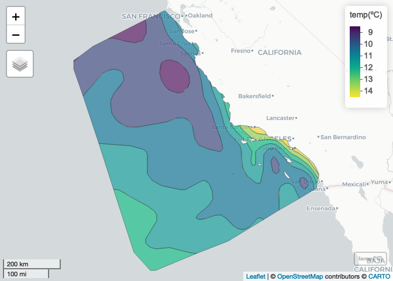
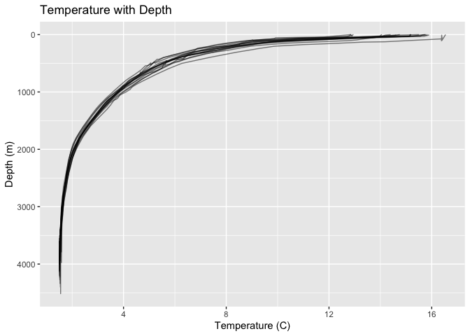

calcofi4r
================

R package of helper functions for reading and visualizing data from the
CalCOFI API at [api.calcofi.io](https://api.calcofi.io).

## Install R package

## Map contours of a variable

``` r
# map contours, aka isobands, of variable using generalized additive model (GAM)
v_ply <- map_contours(
  df = bottle_temp_lonlat, ply = area_calcofi_extended)

# show contour polygons on map 
mapview::mapView(v_ply, zcol="v", layer.name="temp(ºC)")
```

<!-- -->

## Plot time series of an oceanographic variable

``` r
library(calcofi4r)

# get variables
(v <- get_variables())
#> # A tibble: 3 × 6
#>   category      table_field          plot_title        plot_la…¹ plot_…² color…³
#>   <chr>         <chr>                <chr>             <chr>     <chr>   <chr>  
#> 1 Oceanographic ctd_bottles.t_degc   Temperature       Temperat… red     Reds   
#> 2 Oceanographic ctd_bottles.salinity Salinity          Salinity… purple  Purples
#> 3 Oceanographic ctd_bottles.o2sat    Oxygen Saturation Oxygen p… blue    Blues  
#> # … with abbreviated variable names ¹​plot_label, ²​plot_color, ³​color_palette

# fetch time series data for the first variable from CalCOFI API
(d <- get_timeseries(v$table_field[1]))
#> # A tibble: 71 × 4
#>     year val_avg val_sd n_obs
#>    <dbl>   <dbl>  <dbl> <dbl>
#>  1  1949    9.12   4.68 28081
#>  2  1950    9.12   4.37 38298
#>  3  1951    9.19   4.54 40459
#>  4  1952   10.4    4.03 31690
#>  5  1953   10.6    3.71 29789
#>  6  1954   10.8    4.33 18874
#>  7  1955   10.1    4.71 23248
#>  8  1956   11.2    4.41 14274
#>  9  1957   13.0    5.04 19072
#> 10  1958   12.1    4.71 24324
#> # … with 61 more rows

# plot time series with the first variable
with(v[1,],
  plot_timeseries(
    # data and columns (from d)
    d, year, val_avg, val_sd,
    # plot attributes (from v)
    plot_title, plot_label, plot_color))
```

<!-- -->

## Plot depth of an oceanographic variable

``` r
head(bottle_temp_depth)
#> # A tibble: 6 × 3
#> # Groups:   cast_count [1]
#>   cast_count depth_m     v
#>        <int>   <dbl> <dbl>
#> 1      12874       0  15.5
#> 2      12874       8  14.8
#> 3      12874      10  14.7
#> 4      12874      20  14.2
#> 5      12874      23  14.2
#> 6      12874      30  14.2

# plot depth with the station data
plot_depth(
  df = bottle_temp_depth, variable = "Temperature",
  interactive = F)
```

<!-- -->

## Map interpolated oceanographic variable for a cruise

``` r
# get cruises
(z <- get_cruises())
#> # A tibble: 658 × 8
#>    cruiseid        date_beg   date_end   lon_min lon_max lat_min lat_max n_casts
#>    <chr>           <date>     <date>       <dbl>   <dbl>   <dbl>   <dbl>   <dbl>
#>  1 2020-01-05-C-3… 2020-01-05 2020-01-26   -126.   -117.    29.9    37.8     104
#>  2 2019-11-04-C-3… 2019-11-04 2019-11-18   -124.   -117.    29.8    35.1      75
#>  3 2019-07-11-C-3… 2019-07-11 2019-07-26   -124.   -117.    30.2    35.1      70
#>  4 2019-04-02-C-3… 2019-04-02 2019-04-17   -124.   -117.    29.9    35.1      67
#>  5 2019-02-07-C-3… 2019-02-07 2019-02-12   -124.   -118.    31.1    34.5      29
#>  6 2018-10-14-C-3… 2018-10-14 2018-10-29   -124.   -117.    29.8    35.1      74
#>  7 2018-06-09-C-3… 2018-06-09 2018-06-24   -124.   -117.    29.8    35.1      72
#>  8 2018-04-05-C-3… 2018-04-05 2018-04-26   -126.   -117.    29.8    37.8     103
#>  9 2018-02-01-C-3… 2018-02-01 2018-02-10   -124.   -118.    31.1    35.1      45
#> 10 2017-11-09-C-3… 2017-11-09 2017-11-24   -124.   -117.    29.8    35.1      74
#> # … with 648 more rows

# get path of temporary file to store raster
(r_tif <- tempfile(fileext=".tif"))
#> [1] "/var/folders/sl/7s3zmk1129jcrgsn1c4hcs2r0000gn/T//RtmpZFLFdm/file144af411eac5a.tif"

# use second variable from previously fetched v
c(v$table_field[2], v$plot_label[2])
#> [1] "ctd_bottles.salinity"                "Salinity (practical salinity scale)"

# fetch interpolated raster from CalCOFI API
get_raster(
  variable = v$table_field[2],
  cruise_id = "2020-01-05-C-33RL",
  depth_m_min = 0, depth_m_max = 200,
  out_tif = r_tif)
#> [1] "/var/folders/sl/7s3zmk1129jcrgsn1c4hcs2r0000gn/T//RtmpZFLFdm/file144af411eac5a.tif"

# read raster
r <- raster::raster(r_tif)

# plot raster
map_raster(r, v$plot_label[2])
#> Warning in showSRID(uprojargs, format = "PROJ", multiline = "NO", prefer_proj =
#> prefer_proj): Discarded ellps WGS 84 in Proj4 definition: +proj=merc +a=6378137
#> +b=6378137 +lat_ts=0 +lon_0=0 +x_0=0 +y_0=0 +k=1 +units=m +nadgrids=@null
#> +wktext +no_defs +type=crs
#> Warning in showSRID(uprojargs, format = "PROJ", multiline = "NO", prefer_proj =
#> prefer_proj): Discarded datum World Geodetic System 1984 in Proj4 definition
```

<!-- -->

``` r
# cleanup by deleting temporary file
unlink(r_tif)
```

## Code of Conduct

Please note that the `calcofi4r` project is released with a [Contributor
Code of
Conduct](https://calcofi.github.io/calcofi4r/CODE_OF_CONDUCT.html). By
contributing to this project, you agree to abide by its terms.
