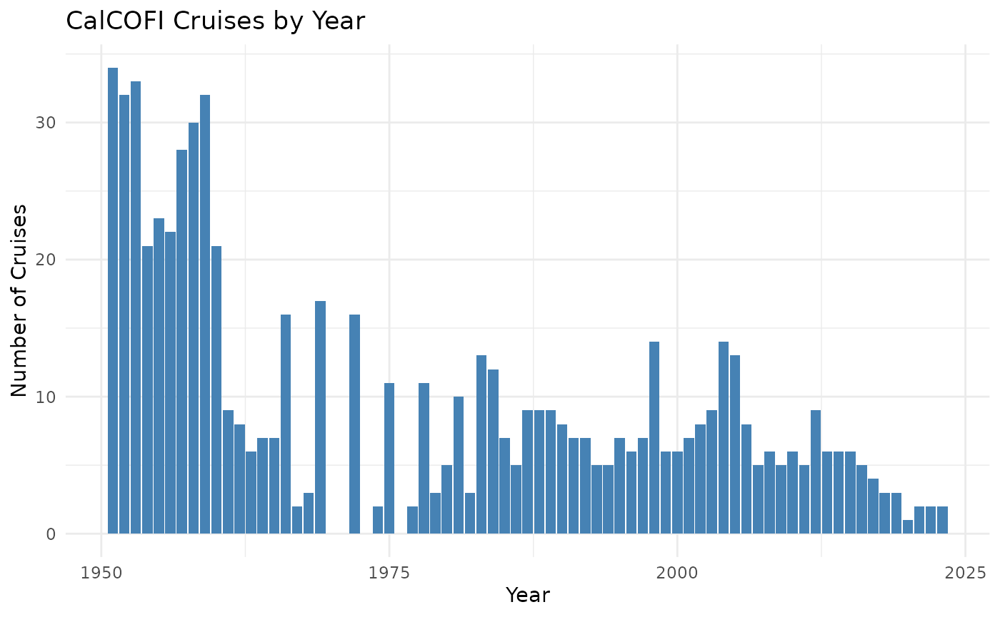

# calcofi4r

## Introduction

The `calcofi4r` package provides access to the CalCOFI (California
Cooperative Oceanic Fisheries Investigations) database, which contains
over 75 years of oceanographic and biological data from the California
Current ecosystem.

The database is organized into a tidy relational structure stored as
Parquet files on Google Cloud Storage. This allows fast queries without
downloading the entire database.

## Connect to the Database

``` r

library(calcofi4r)
library(dplyr)
library(DBI)
library(sf)
library(mapview)

# connect to the latest CalCOFI database release
con <- cc_get_db()
q <- dbExecute(con, "INSTALL spatial; LOAD spatial;")

# list available tables
dbListTables(con)
#>  [1] "_spatial"           "_spatial_attr"      "bottle"            
#>  [4] "bottle_measurement" "cast_condition"     "casts"             
#>  [7] "cruise"             "cruise_summary"     "ctd_cast"          
#> [10] "ctd_summary"        "ctd_thin"           "dataset"           
#> [13] "dic_measurement"    "dic_sample"         "dic_summary"       
#> [16] "grid"               "ichthyo"            "invert"            
#> [19] "lookup"             "measurement_type"   "net"               
#> [22] "segment"            "ship"               "site"              
#> [25] "species"            "taxa_rank"          "taxon"             
#> [28] "tow"
```

## Convenience Functions

The package provides convenience functions for common operations:

``` r

# list available versions
cc_list_versions()
#> # A tibble: 12 × 6
#>    version     release_date tables total_rows size_mb is_latest
#>    <chr>       <chr>         <int>      <int>   <dbl> <lgl>    
#>  1 v2026.06.08 2026-06-08       44  133807311   3553. FALSE    
#>  2 v2026.06.07 2026-06-07       28  133015544   3547. TRUE     
#>  3 v2026.05.20 2026-05-20       28  133022102   5503  FALSE    
#>  4 v2026.05.19 2026-05-19       28  133022102   5503. FALSE    
#>  5 v2026.05.15 2026-05-15       28  133013839      0  FALSE    
#>  6 v2026.05.14 2026-05-14       28  133013839      0  FALSE    
#>  7 v2026.04.08 2026-04-08       28  357418040      0  FALSE    
#>  8 v2026.04.06 2026-04-06       29  361200542      0  FALSE    
#>  9 v2026.04.03 2026-04-03       29  361183451      0  FALSE    
#> 10 v2026.04.02 2026-04-02       43  361152303  11498. FALSE    
#> 11 v2026.03.25 2026-03-25       18  354898020  11263. FALSE    
#> 12 v2026.03.14 2026-03-14       20  357001188  11330. FALSE

# list tables
cc_list_tables()
#>  [1] "_spatial"           "_spatial_attr"      "bottle"            
#>  [4] "bottle_measurement" "cast_condition"     "casts"             
#>  [7] "cruise"             "cruise_summary"     "ctd_cast"          
#> [10] "ctd_summary"        "ctd_thin"           "dataset"           
#> [13] "dic_measurement"    "dic_sample"         "dic_summary"       
#> [16] "grid"               "ichthyo"            "invert"            
#> [19] "lookup"             "measurement_type"   "net"               
#> [22] "segment"            "ship"               "site"              
#> [25] "species"            "taxa_rank"          "taxon"             
#> [28] "tow"

# describe a table
cc_describe_table("ichthyo")
#> # A tibble: 11 × 6
#>    column_name       data_type is_nullable name_long        units description_md
#>    <chr>             <chr>     <chr>       <chr>            <chr> <chr>         
#>  1 ichthyo_uuid      UUID      YES         "Ichthyo UUID"   NA    "Deterministi…
#>  2 net_uuid          UUID      YES         "Net UUID"       NA    "Foreign key …
#>  3 species_id        SMALLINT  YES         "Species ID"     NA    "Foreign key …
#>  4 life_stage        VARCHAR   YES         "Life Stage"     NA    "Life stage: …
#>  5 measurement_type  VARCHAR   YES         "Measurement Ty… NA    "Type of meas…
#>  6 measurement_value DOUBLE    YES         "Measurement Va… NA    "Numeric valu…
#>  7 tally             INTEGER   YES         "Tally"          count "Raw count of…
#>  8 _source_file      VARCHAR   YES         " Source File"   NA    ""            
#>  9 _source_row       INTEGER   YES         " Source Row"    NA    ""            
#> 10 _ingested_at      TIMESTAMP YES         " Ingested At"   NA    ""            
#> 11 _source_uuid      VARCHAR   YES         " Source Uuid"   NA    ""

# list measurement types
cc_list_measurement_types() |> head(10)
#> # A tibble: 10 × 3
#>    measurement_type    description                  units    
#>    <chr>               <chr>                        <chr>    
#>  1 alkalinity          Total alkalinity             umol/kg  
#>  2 alkalinity_rep1     Total alkalinity replicate 1 umol/kg  
#>  3 alkalinity_rep2     Total alkalinity replicate 2 umol/kg  
#>  4 ammonia             Ammonia concentration (QC'd) umol/L   
#>  5 barometric_pressure Barometric pressure          millibars
#>  6 beam_attenuation    Beam attenuation coefficient 1/m      
#>  7 btl_ammonium        Bottle ammonium              umol/L   
#>  8 btl_chlorophyll_a   Bottle chlorophyll-a         ug/L     
#>  9 btl_depth           Bottle trip depth            m        
#> 10 btl_nitrate         Bottle nitrate               umol/L
```

### Read Data Directly

Convenience functions return tibbles with optional filtering:

``` r

# read species data
species <- cc_read_species()
head(species)
#> # A tibble: 6 × 10
#>   species_id scientific_name itis_id worms_id common_name         `_source_file`
#>        <int> <chr>             <int>    <int> <chr>               <chr>         
#> 1          1 Teleostei        161105   293496 Unidentified Telio… gs://calcofi-…
#> 2          3 Elopidae         161109   153689 Tenpounders         gs://calcofi-…
#> 3          4 Elops affinis    161112   275403 Machete             gs://calcofi-…
#> 4          5 Albulidae        161119   151805 Bonefishes          gs://calcofi-…
#> 5          7 Albula           161120   157878 NA                  gs://calcofi-…
#> 6          9 Clupeiformes     161694    10297 NA                  gs://calcofi-…
#> # ℹ 4 more variables: `_source_row` <int>, `_ingested_at` <dttm>,
#> #   `_source_uuid` <chr>, gbif_id <int>

# read ichthyo data (first 100 rows for demo)
ichthyo_sample <- cc_read_ichthyo() |> head(100)
head(ichthyo_sample)
#> # A tibble: 6 × 11
#>   ichthyo_uuid net_uuid species_id life_stage measurement_type measurement_value
#>   <chr>        <chr>         <int> <chr>      <chr>                        <dbl>
#> 1 d7d7f5c3-17… eb8733f…          1 egg        NA                              NA
#> 2 0360608f-cf… ec8733f…          1 egg        NA                              NA
#> 3 b08d9ed2-40… ef8733f…          1 egg        NA                              NA
#> 4 4264c438-9c… f38733f…          1 egg        NA                              NA
#> 5 72b8c81d-1c… f48733f…          1 egg        NA                              NA
#> 6 19492607-0f… f58733f…          1 egg        NA                              NA
#> # ℹ 5 more variables: tally <int>, `_source_file` <chr>, `_source_row` <int>,
#> #   `_ingested_at` <dttm>, `_source_uuid` <chr>

# read with filtering (lazy query)
anchovy <- cc_read_ichthyo(species_id == 19, collect = FALSE)
anchovy |> head(5) |> collect()
#> # A tibble: 5 × 11
#>   ichthyo_uuid net_uuid species_id life_stage measurement_type measurement_value
#>   <chr>        <chr>         <int> <chr>      <chr>                        <dbl>
#> 1 d4aa72df-b0… be8833f…         19 egg        NA                              NA
#> 2 2a818847-d0… c68833f…         19 egg        NA                              NA
#> 3 f324eced-b1… c98833f…         19 egg        NA                              NA
#> 4 873cabc2-c7… ca8833f…         19 egg        NA                              NA
#> 5 5a24d010-81… cb8833f…         19 egg        NA                              NA
#> # ℹ 5 more variables: tally <int>, `_source_file` <chr>, `_source_row` <int>,
#> #   `_ingested_at` <dttm>, `_source_uuid` <chr>
```

## Database Schema

The CalCOFI database contains data from two main programs:

**Ichthyoplankton Survey** (since 1949):

- `cruise` - cruise metadata (691 cruises)
- `ship` - research vessels (48 ships)
- `site` - sampling locations (61K sites)
- `tow` - net tow events (76K tows)
- `net` - net samples (77K nets)
- `ichthyo` - fish larvae counts (831K records)
- `species` - species taxonomy (1,144 species)
- `taxon` - taxonomic hierarchy
- `grid` - CalCOFI station grid (218 cells)
- `segment` - line segments between stations

**Bottle Database** (since 1949):

- `casts` - CTD/bottle cast events (36K casts)
- `bottle` - water sample bottles (895K bottles)
- `bottle_measurement` - oceanographic measurements (11M records)
- `measurement_type` - measurement definitions (47 types)
- `cast_condition` - cast quality flags

``` r

# show row counts for each table
tables <- dbListTables(con)
tibble(
  table = tables,
  rows  = sapply(tables, function(t) {
    dbGetQuery(con, sprintf("SELECT COUNT(*) as n FROM %s", t))$n
  })) |>
  arrange(desc(rows))
#> # A tibble: 28 × 2
#>    table                   rows
#>    <chr>                  <dbl>
#>  1 ctd_summary        108390249
#>  2 bottle_measurement  11135600
#>  3 ctd_thin             5551551
#>  4 ctd_cast             5550014
#>  5 bottle                895371
#>  6 ichthyo               852228
#>  7 cast_condition        235513
#>  8 net                    76512
#>  9 tow                    75506
#> 10 site                   61104
#> # ℹ 18 more rows
```

## Query Bottle Data

The bottle data contains oceanographic measurements from CTD casts.
Measurements are stored in a normalized “long” format in
`bottle_measurement`.

``` r

# get temperature measurements with location and depth
d_temp <- dbGetQuery(con, "
  SELECT
    c.lon_dec as lon,
    c.lat_dec as lat,
    c.datetime_utc,
    b.depth_m,
    bm.measurement_value as temperature
  FROM bottle_measurement bm
  JOIN bottle b ON bm.bottle_id = b.bottle_id
  JOIN casts c ON b.cast_id = c.cast_id
  WHERE bm.measurement_type = 'temperature'
    AND bm.measurement_value IS NOT NULL
    AND b.depth_m <= 10
  LIMIT 100000")

head(d_temp)
#>         lon      lat        datetime_utc depth_m temperature
#> 1 -117.4667 33.24167 1975-06-26 13:40:00       0       17.31
#> 2 -117.4667 33.24167 1975-06-26 13:40:00       5       14.78
#> 3 -117.4667 33.24167 1975-06-26 13:40:00      10       13.36
#> 4 -117.4917 33.23333 1975-06-26 15:03:00       0       17.11
#> 5 -117.4917 33.23333 1975-06-26 15:03:00      10       13.01
#> 6 -117.5667 33.19167 1975-06-26 16:21:00       0       17.25
nrow(d_temp)
#> [1] 93985
```

### Summarize by Location

``` r

# summarize surface temperature by location
d_t <- d_temp |>
  group_by(lon, lat) |>
  summarize(
    n     = n(),
    t_avg = mean(temperature, na.rm = TRUE),
    .groups = "drop") |>
  filter(!is.na(lon), !is.na(lat)) |>
  st_as_sf(coords = c("lon", "lat"), crs = 4326, remove = FALSE)

head(d_t)
#> Simple feature collection with 6 features and 4 fields
#> Geometry type: POINT
#> Dimension:     XY
#> Bounding box:  xmin: -164.0833 ymin: 20.05 xmax: -150.025 ymax: 42.38333
#> Geodetic CRS:  WGS 84
#> # A tibble: 6 × 5
#>     lon   lat     n t_avg             geometry
#>   <dbl> <dbl> <int> <dbl>          <POINT [°]>
#> 1 -164.  42       2  10.1       (-164.0833 42)
#> 2 -158.  42.4    16  16.7 (-157.9833 42.36667)
#> 3 -158.  42.4     4  11.8 (-157.9833 42.38333)
#> 4 -153.  20.1     4  24.2    (-153.1 20.10833)
#> 5 -150.  31.2     3  23.1     (-150.1167 31.2)
#> 6 -150.  20.0     4  24.3     (-150.025 20.05)
```

## CalCOFI Grid

The CalCOFI sampling grid defines standard station positions. The
package includes pre-loaded grid data:

- `cc_grid` - station polygons
- `cc_grid_ctrs` - station centroids
- `cc_grid_zones` - aggregated zones by station pattern

``` r

# show the CalCOFI grid colored by zone
mapview(cc_grid, zcol = "zone_key", layer.name = "Zone") +
  mapview(cc_grid_ctrs, cex = 1, col.regions = "black", legend = FALSE)
```

### Grid from Database

The grid is also available in the database with additional attributes:

``` r

# query grid from database (includes geometry)
grid_db <- dbGetQuery(con, "SELECT * EXCLUDE(geom, geom_ctr) FROM grid")
head(grid_db)
#>          grid_key station line     shore    pattern spacing
#> 1   st0-ln10_hist       0   10 nearshore historical      20
#> 2  st20-ln10_hist      20   10 nearshore historical      20
#> 3  st40-ln10_hist      40   10 nearshore historical      20
#> 4  st60-ln10_hist      60   10 nearshore historical      20
#> 5  st80-ln10_hist      80   10  offshore historical      20
#> 6 st100-ln10_hist     100   10  offshore historical      20
#>                   zone area_km2
#> 1 nearshore-historical 23111.47
#> 2 nearshore-historical 32060.98
#> 3 nearshore-historical 32467.41
#> 4 nearshore-historical 32869.45
#> 5  offshore-historical 33267.04
#> 6  offshore-historical 33660.13
```

## Show Effort by Grid Cell

Join temperature observations to the CalCOFI grid to show sampling
effort:

``` r

# count observations per grid cell
n_grid <- cc_grid |>
  st_join(d_t) |>
  group_by(sta_key) |>
  summarize(n = sum(n, na.rm = TRUE))

mapview(n_grid, zcol = "n", layer.name = "Observations")
```

### Show Effort by Station Point

``` r

# join counts to centroids
n_pts <- cc_grid_ctrs |>
  left_join(
    n_grid |> st_drop_geometry() |> select(sta_key, n),
    by = "sta_key")

mapview(n_pts, cex = "n", layer.name = "Observations")
```

## Map Contours

Interpolate temperature data to create contour maps using Inverse
Distance Weighting (IDW).

### All Zones

``` r

# interpolate points to raster using IDW
r_all <- pts_to_rast_idw(d_t, "t_avg", cc_grid_zones)

# generate contour polygons
p_all <- rast_to_contours(r_all, cc_grid_zones)
mapview(p_all, zcol = "z_avg", layer.name = "Temp (C)")
```

### Standard and Extended Pattern

``` r

# filter to standard + extended zones
aoi_ext <- cc_grid_zones |>
  filter(sta_pattern %in% c("standard", "extended"))

# interpolate and contour
r_ext <- pts_to_rast_idw(d_t, "t_avg", aoi_ext)
p_ext <- rast_to_contours(r_ext, aoi_ext)
mapview(p_ext, zcol = "z_avg", layer.name = "Temp (C)")
```

## Query Ichthyoplankton Data

The ichthyoplankton survey counts fish larvae by species across sampling
sites.

``` r

# get top 10 species by total count
top_species <- dbGetQuery(con, "
  SELECT
    s.scientific_name,
    s.common_name,
    SUM(i.tally) as total_count,
    COUNT(DISTINCT n.tow_uuid) as n_tows
  FROM ichthyo i
  JOIN species s ON i.species_id = s.species_id
  JOIN net n ON i.net_uuid = n.net_uuid
  GROUP BY s.scientific_name, s.common_name
  ORDER BY total_count DESC
  LIMIT 10")

top_species
#>              scientific_name                common_name total_count n_tows
#> 1                  Teleostei       Unidentified Teliost     8960182  61416
#> 2           Engraulis mordax           Northern anchovy     8553961  29491
#> 3            Sardinops sagax Pacific sardine (pilchard)     1430924   9766
#> 4       Merluccius productus    Pacific hake or whiting     1298807  12527
#> 5       Vinciguerria lucetia           Panama lightfish      500036  14829
#> 6                   Sebastes                 Rockfishes      289447  18187
#> 7      Trachurus symmetricus              Jack mackerel      260927   9526
#> 8      Leuroglossus stilbius    California smoothtongue      184814  12450
#> 9  Stenobrachius leucopsarus          Northern lampfish      178543  12726
#> 10     Triphoturus mexicanus           Mexican lampfish      147571  14572
```

### Species Distribution

Map the distribution of a common species:

``` r

# get Northern Anchovy observations with locations
anchovy <- dbGetQuery(con, "
  SELECT
    si.latitude as lat,
    si.longitude as lon,
    SUM(i.tally) as count
  FROM ichthyo i
  JOIN species sp ON i.species_id = sp.species_id
  JOIN net n ON i.net_uuid = n.net_uuid
  JOIN tow t ON n.tow_uuid = t.tow_uuid
  JOIN site si ON t.site_uuid = si.site_uuid
  WHERE sp.scientific_name = 'Engraulis mordax'
  GROUP BY si.latitude, si.longitude") |>
  filter(!is.na(lon), !is.na(lat)) |>
  st_as_sf(coords = c("lon", "lat"), crs = 4326)

mapview(anchovy, cex = "count", layer.name = "Anchovy count")
```

## Cruise Timeline

View the temporal coverage of CalCOFI cruises:

``` r

# get cruise timeline (date_ym is YYYYMM format)
cruises <- dbGetQuery(con, "
  SELECT
    cruise_key,
    CAST(SUBSTRING(CAST(date_ym AS VARCHAR), 1, 4) AS INTEGER) as year,
    CAST(SUBSTRING(CAST(date_ym AS VARCHAR), 5, 2) AS INTEGER) as month,
    ship_key
  FROM cruise
  WHERE date_ym IS NOT NULL
  ORDER BY date_ym")

# count cruises by year
cruises |>
  count(year) |>
  filter(!is.na(year)) |>
  ggplot2::ggplot(ggplot2::aes(year, n)) +
  ggplot2::geom_col(fill = "steelblue") +
  ggplot2::labs(
    title = "CalCOFI Cruises by Year",
    x = "Year", y = "Number of Cruises") +
  ggplot2::theme_minimal()
```



## Available Measurement Types

The bottle database includes many oceanographic variables:

``` r

# list all measurement types
dbGetQuery(con, "
  SELECT measurement_type, description, units
  FROM measurement_type
  ORDER BY measurement_type") |>
  head(20)
#>       measurement_type                                 description      units
#> 1           alkalinity                            Total alkalinity    umol/kg
#> 2      alkalinity_rep1                Total alkalinity replicate 1    umol/kg
#> 3      alkalinity_rep2                Total alkalinity replicate 2    umol/kg
#> 4              ammonia                Ammonia concentration (QC'd)     umol/L
#> 5  barometric_pressure                         Barometric pressure  millibars
#> 6     beam_attenuation                Beam attenuation coefficient        1/m
#> 7         btl_ammonium                             Bottle ammonium     umol/L
#> 8    btl_chlorophyll_a                        Bottle chlorophyll-a       ug/L
#> 9            btl_depth                           Bottle trip depth          m
#> 10         btl_nitrate                              Bottle nitrate     umol/L
#> 11         btl_nitrite                              Bottle nitrite     umol/L
#> 12    btl_phaeopigment                         Bottle phaeopigment       ug/L
#> 13       btl_phosphate                            Bottle phosphate     umol/L
#> 14        btl_silicate                             Bottle silicate     umol/L
#> 15     btl_temperature                          Bottle temperature       degC
#> 16            c14_dark        14C assimilation dark/control bottle mgC/m3/hld
#> 17            c14_mean Mean 14C assimilation of replicates 1 and 2 mgC/m3/hld
#> 18            c14_rep1                14C assimilation replicate 1 mgC/m3/hld
#> 19            c14_rep2                14C assimilation replicate 2 mgC/m3/hld
#> 20       chlorophyll_a     Chlorophyll-a measured fluorometrically       ug/L
```

## Disconnect

Always close the database connection when finished:

``` r

dbDisconnect(con)
```

## Package Data Objects

The package also includes pre-loaded spatial data objects for
convenience:

- `cc_grid` - CalCOFI station grid polygons (sf)
- `cc_grid_ctrs` - Station centroids (sf)
- `cc_grid_zones` - Aggregated zone polygons (sf)
- `cc_bottle` - Sample bottle data for examples (tibble)

These can be used without connecting to the database for quick spatial
operations.
