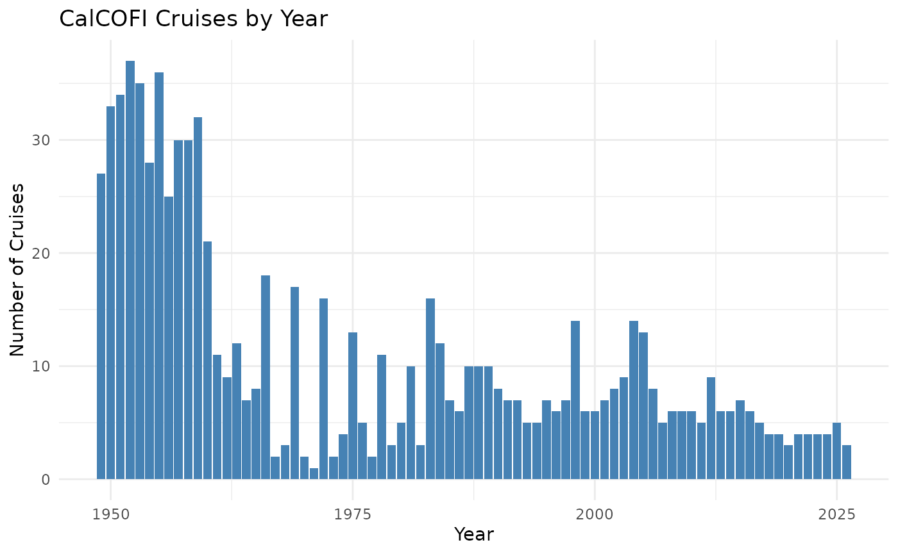

# calcofi4r

## Introduction

The `calcofi4r` package provides access to the CalCOFI (California
Cooperative Oceanic Fisheries Investigations) database, which contains
over 75 years of oceanographic and biological data from the California
Current ecosystem.

The database is organized into a tidy relational structure stored as
Parquet files on Google Cloud Storage. This allows fast queries without
downloading the entire database.

## Connect to the Database

``` r

library(calcofi4r)
library(dplyr)
library(DBI)
library(sf)
library(mapview)

# connect to the latest CalCOFI database release
con <- cc_get_db()
q <- dbExecute(con, "INSTALL spatial; LOAD spatial;")

# list available tables
dbListTables(con)
#>  [1] "cruise"             "dataset"            "dataset_taxon"     
#>  [4] "grid"               "lookup"             "measurement_type"  
#>  [7] "obs"                "obs_attribute"      "region"            
#> [10] "sample"             "sample_measurement" "ship"              
#> [13] "spatial"            "spatial_attribute"  "taxon"             
#> [16] "taxon_group"
```

## Convenience Functions

The package provides convenience functions for common operations:

``` r

# list available versions
cc_list_versions()
#> # A tibble: 28 × 8
#>    version     release_date tables total_rows size_mb consolidated
#>    <chr>       <chr>         <int>      <int>   <dbl> <lgl>       
#>  1 v2026.08.25 2026-08-25       18  320260205   1998. TRUE        
#>  2 v2026.08.14 2026-08-14       18  307537056   1930. TRUE        
#>  3 v2026.08.11 2026-08-11       18  323912311   2016. FALSE       
#>  4 v2026.08.10 2026-08-11       18  323912364   2017. FALSE       
#>  5 v2026.08.08 2026-08-08       18  309122838   1947  FALSE       
#>  6 v2026.08.07 2026-08-07       18  323733662   2024. FALSE       
#>  7 v2026.08.06 2026-08-06       18  255137845   1636. FALSE       
#>  8 v2026.08.05 2026-08-05       18  255137845   1636. FALSE       
#>  9 v2026.08.04 2026-08-04       18  255155031   1635  FALSE       
#> 10 v2026.08.03 2026-08-03       18  255037035   2057. FALSE       
#> # ℹ 18 more rows
#> # ℹ 2 more variables: retired <df[,3]>, is_latest <lgl>

# list tables (con = reuses the connection opened above)
cc_list_tables(con = con)
#>  [1] "cruise"             "dataset"            "dataset_taxon"     
#>  [4] "grid"               "lookup"             "measurement_type"  
#>  [7] "obs"                "obs_attribute"      "region"            
#> [10] "sample"             "sample_measurement" "ship"              
#> [13] "spatial"            "spatial_attribute"  "taxon"             
#> [16] "taxon_group"

# describe a table
cc_describe_table("obs", con = con)
#> # A tibble: 18 × 6
#>    column_name       data_type is_nullable name_long        units description_md
#>    <chr>             <chr>     <chr>       <chr>            <chr> <chr>         
#>  1 obs_id            BIGINT    YES         Observation ID   NA    Surrogate key…
#>  2 realm             VARCHAR   YES         Realm            NA    `env` for phy…
#>  3 sample_key        VARCHAR   YES         Sample Key       NA    The sampling …
#>  4 grid_key          VARCHAR   YES         Grid Key         NA    CalCOFI stati…
#>  5 cruise_key        VARCHAR   YES         Cruise Key       NA    Cruise, denor…
#>  6 latitude          DOUBLE    YES         Latitude         deci… Observation l…
#>  7 longitude         DOUBLE    YES         Longitude        deci… Observation l…
#>  8 datetime          TIMESTAMP YES         Datetime         NA    Observation t…
#>  9 depth_min_m       DOUBLE    YES         Depth Min        m     Shallowest de…
#> 10 depth_max_m       DOUBLE    YES         Depth Max        m     Deepest depth…
#> 11 taxon_key         VARCHAR   YES         Taxon Key        NA    Global taxon …
#> 12 life_stage        VARCHAR   YES         Life Stage       NA    Life stage wh…
#> 13 measurement_type  VARCHAR   YES         Measurement Type NA    Measured quan…
#> 14 measurement_value DOUBLE    YES         Measurement Val… NA    The measured …
#> 15 measurement_qual  VARCHAR   YES         Measurement Qua… NA    Source qualit…
#> 16 measurement_prec  DOUBLE    YES         Measurement Pre… NA    Source-report…
#> 17 hex_id            UBIGINT   YES         Hex ID           NA    H3 cell at re…
#> 18 dataset_key       VARCHAR   YES         Dataset Key      NA    Provenance st…

# list measurement types
cc_list_measurement_types(con = con) |> head(10)
#> # A tibble: 10 × 3
#>    measurement_type    description                                         units
#>    <chr>               <chr>                                               <chr>
#>  1 abundance           Specimen count per net tow (headline occurrence; s… count
#>  2 air_temp_c          Air temperature                                     deg_C
#>  3 alkalinity          Total alkalinity                                    umol…
#>  4 alkalinity_rep1     Total alkalinity replicate 1                        umol…
#>  5 alkalinity_rep2     Total alkalinity replicate 2                        umol…
#>  6 ammonia             Ammonia concentration (QC'd)                        umol…
#>  7 anchovy_eggs        Northern anchovy egg count                          count
#>  8 atm_pressure_mb     Atmospheric pressure (ship level)                   mb   
#>  9 atm_pressure_slc_mb Atmospheric pressure (sea-level corrected)          mb   
#> 10 barometric_pressure Barometric pressure                                 mill…
```

### Read Data Directly

Convenience functions return tibbles with optional filtering:

``` r

# taxonomy: one row per taxon, keyed worms:<id> or itis:<id>
taxa <- cc_read_taxon()
head(taxa)
#> # A tibble: 6 × 19
#>   taxon_key worms_id itis_id gbif_id ncbi_id inat_id scientific_name common_name
#>   <chr>        <int>   <int>   <int>   <int>   <int> <chr>           <chr>      
#> 1 calcofi_…       NA      NA      NA      NA      NA NA              NA         
#> 2 calcofi_…       NA      NA      NA      NA      NA NA              NA         
#> 3 calcofi_…       NA      NA      NA      NA      NA NA              NA         
#> 4 calcofi_…       NA      NA      NA      NA      NA NA              NA         
#> 5 calcofi_…       NA      NA      NA      NA      NA NA              NA         
#> 6 calcofi_…       NA      NA      NA      NA      NA NA              NA         
#> # ℹ 11 more variables: rank <chr>, rank_order <int>, taxonomic_status <chr>,
#> #   status_checked <chr>, parent_taxon_key <chr>, kingdom <chr>, phylum <chr>,
#> #   class <chr>, order_taxon <chr>, family <chr>, notes <chr>

# ichthyoplankton occurrences
ichthyo_sample <- cc_read_ichthyo() |> head(100)
head(ichthyo_sample)
#> # A tibble: 6 × 18
#>     obs_id realm sample_key               grid_key cruise_key latitude longitude
#>      <dbl> <chr> <chr>                    <chr>    <chr>         <dbl>     <dbl>
#> 1 25779682 bio   swfsc_ichthyo:net:dc086… st-20-l… 1999-10-3…     25.3     -109.
#> 2 25779683 bio   swfsc_ichthyo:net:dc086… st-20-l… 1999-10-3…     25.3     -109.
#> 3 25779684 bio   swfsc_ichthyo:net:dc086… st-20-l… 1999-10-3…     25.3     -109.
#> 4 25779685 bio   swfsc_ichthyo:net:dc086… st-20-l… 1999-10-3…     25.3     -109.
#> 5 25779686 bio   swfsc_ichthyo:net:dc086… st-20-l… 1999-10-3…     25.3     -109.
#> 6 25779687 bio   swfsc_ichthyo:net:dc086… st-20-l… 1999-10-3…     25.3     -109.
#> # ℹ 11 more variables: datetime <dttm>, depth_min_m <dbl>, depth_max_m <dbl>,
#> #   taxon_key <chr>, life_stage <chr>, measurement_type <chr>,
#> #   measurement_value <dbl>, measurement_qual <chr>, measurement_prec <dbl>,
#> #   hex_id <dbl>, dataset_key <chr>
```

## Database Schema

The database used to expose one table triple per dataset — `ichthyo`,
`bottle`, `bottle_measurement`, `casts`, `species` and roughly thirty
more. Those are gone. Every dataset now projects into one small **core**
family, so a query written against ichthyoplankton works unchanged
against CTD, zooplankton or seabirds:

- **`obs`** — the occurrence table, one scalar per row. `realm` is `bio`
  or `env`; biology carries `taxon_key`, environment carries a
  measurement type.
- **`sample`** — one row per physical sampling event (cast, tow, net,
  bottle, transect), with an adjacency list via `parent_sample_key` /
  `root_sample_key`.
- **`obs_attribute`** — sub-occurrence detail: length and stage
  frequency, plus categorical behaviour.
- **`sample_measurement`** — event-level effort (volume sampled, haul
  factor, cast conditions).

Shared references: **`taxon`** (one row per taxon, keyed `worms:<id>` or
`itis:<id>`), **`dataset_taxon`** (each dataset’s vocabulary crosswalked
to it), **`taxon_group`**, **`cruise`**, **`ship`**, **`grid`**,
**`measurement_type`**, **`spatial`** / **`spatial_attribute`**,
**`region`**, **`dataset`**, **`lookup`**.

Full column-level reference:
[calcofi.io/schema](https://calcofi.io/schema/).

``` r

# show row counts for each table
tables <- dbListTables(con)
tibble(
  table = tables,
  rows  = sapply(tables, function(t) {
    dbGetQuery(con, sprintf("SELECT COUNT(*) as n FROM %s", t))$n
  })) |>
  arrange(desc(rows))
#> # A tibble: 16 × 2
#>    table                  rows
#>    <chr>                 <dbl>
#>  1 obs                26261931
#>  2 sample              1467245
#>  3 sample_measurement   589603
#>  4 obs_attribute        452789
#>  5 spatial_attribute    148461
#>  6 spatial               13206
#>  7 taxon                  2125
#>  8 dataset_taxon          1910
#>  9 cruise                  691
#> 10 grid                    218
#> 11 measurement_type        200
#> 12 taxon_group             151
#> 13 ship                     49
#> 14 lookup                   26
#> 15 dataset                  16
#> 16 region                    4
```

## Query Environmental Data

Environmental measurements live in `obs` alongside biology,
distinguished by `realm`, in a long format: one row per (sample, depth,
measurement type). Position and time come from `sample`.

``` r

# surface temperature with location and depth
d_temp <- dbGetQuery(con, "
  SELECT
    s.longitude AS lon,
    s.latitude  AS lat,
    s.datetime,
    o.depth_min_m AS depth_m,
    o.measurement_value AS temperature
  FROM obs o
  JOIN sample s USING (sample_key)
  WHERE o.measurement_type = 'temperature'
    AND o.measurement_value IS NOT NULL
    AND o.depth_min_m <= 10
  LIMIT 100000")

head(d_temp)
#>         lon      lat            datetime depth_m temperature
#> 1 -109.3833 22.55000 1950-11-28 19:42:00       0       27.25
#> 2 -109.3833 22.55000 1951-03-08 19:36:00       0       21.81
#> 3 -109.3833 22.55000 1951-06-11 04:36:00       0       24.19
#> 4 -109.3833 22.55000 1951-06-11 07:42:00       0       24.09
#> 5 -109.3167 22.58333 1954-12-04 20:42:00       0       26.00
#> 6 -109.3000 22.65000 1955-02-13 23:24:00       0       20.87
nrow(d_temp)
#> [1] 93985
```

### Summarize by Location

``` r

# summarize surface temperature by location
d_t <- d_temp |>
  group_by(lon, lat) |>
  summarize(
    n     = n(),
    t_avg = mean(temperature, na.rm = TRUE),
    .groups = "drop") |>
  filter(!is.na(lon), !is.na(lat)) |>
  st_as_sf(coords = c("lon", "lat"), crs = 4326, remove = FALSE)

head(d_t)
#> Simple feature collection with 6 features and 4 fields
#> Geometry type: POINT
#> Dimension:     XY
#> Bounding box:  xmin: -164.0833 ymin: 20.05 xmax: -150.025 ymax: 42.38333
#> Geodetic CRS:  WGS 84
#> # A tibble: 6 × 5
#>     lon   lat     n t_avg             geometry
#>   <dbl> <dbl> <int> <dbl>          <POINT [°]>
#> 1 -164.  42       2  10.1       (-164.0833 42)
#> 2 -158.  42.4    16  16.7 (-157.9833 42.36667)
#> 3 -158.  42.4     4  11.8 (-157.9833 42.38333)
#> 4 -153.  20.1     4  24.2    (-153.1 20.10833)
#> 5 -150.  31.2     3  23.1     (-150.1167 31.2)
#> 6 -150.  20.0     4  24.3     (-150.025 20.05)
```

## CalCOFI Grid

The CalCOFI sampling grid defines standard station positions. The
package includes pre-loaded grid data:

- `cc_grid` - station polygons
- `cc_grid_ctrs` - station centroids
- `cc_grid_zones` - aggregated zones by station pattern

``` r

# show the CalCOFI grid colored by zone
mapview(cc_grid, zcol = "zone_key", layer.name = "Zone") +
  mapview(cc_grid_ctrs, cex = 1, col.regions = "black", legend = FALSE)
```

### Grid from Database

The grid is also available in the database with additional attributes:

``` r

# query grid from database (includes geometry)
grid_db <- dbGetQuery(con, "SELECT * EXCLUDE(geom, geom_ctr) FROM grid")
head(grid_db)
#>           grid_key station line     shore    pattern spacing
#> 1 st-20-ln130_hist     -20  130 nearshore historical      20
#> 2 st-20-ln140_hist     -20  140 nearshore historical      20
#> 3 st-20-ln150_hist     -20  150 nearshore historical      20
#> 4 st-20-ln160_hist     -20  160 nearshore historical      20
#> 5 st-40-ln160_hist     -40  160 nearshore historical      20
#> 6    st0-ln10_hist       0   10 nearshore historical      20
#>                   zone  area_km2
#> 1 nearshore-historical  2065.491
#> 2 nearshore-historical 10689.976
#> 3 nearshore-historical 21697.541
#> 4 nearshore-historical 31967.488
#> 5 nearshore-historical  2993.808
#> 6 nearshore-historical 23111.471
```

## Show Effort by Grid Cell

Join temperature observations to the CalCOFI grid to show sampling
effort:

``` r

# count observations per grid cell
n_grid <- cc_grid |>
  st_join(d_t) |>
  group_by(sta_key) |>
  summarize(n = sum(n, na.rm = TRUE))

mapview(n_grid, zcol = "n", layer.name = "Observations")
```

### Show Effort by Station Point

``` r

# join counts to centroids
n_pts <- cc_grid_ctrs |>
  left_join(
    n_grid |> st_drop_geometry() |> select(sta_key, n),
    by = "sta_key")

mapview(n_pts, cex = "n", layer.name = "Observations")
```

## Map Contours

Interpolate temperature data to create contour maps using Inverse
Distance Weighting (IDW).

### All Zones

``` r

# interpolate points to raster using IDW
r_all <- pts_to_rast_idw(d_t, "t_avg", cc_grid_zones)

# generate contour polygons
p_all <- rast_to_contours(r_all, cc_grid_zones)
mapview(p_all, zcol = "z_avg", layer.name = "Temp (C)")
```

### Standard and Extended Pattern

``` r

# filter to standard + extended zones
aoi_ext <- cc_grid_zones |>
  filter(sta_pattern %in% c("standard", "extended"))

# interpolate and contour
r_ext <- pts_to_rast_idw(d_t, "t_avg", aoi_ext)
p_ext <- rast_to_contours(r_ext, aoi_ext)
mapview(p_ext, zcol = "z_avg", layer.name = "Temp (C)")
```

## Query Ichthyoplankton Data

The ichthyoplankton survey counts fish larvae by species across sampling
sites.

``` r

# top 10 taxa by total count. `taxon_key` is global, so the same join works for
# any dataset — swap the dataset_key and this counts euphausiids or seabirds.
top_species <- dbGetQuery(con, "
  SELECT
    t.scientific_name,
    t.common_name,
    SUM(o.measurement_value)      AS total_count,
    COUNT(DISTINCT o.sample_key)  AS n_samples
  FROM obs o
  JOIN taxon t USING (taxon_key)
  WHERE o.realm = 'bio'
    AND o.dataset_key = 'swfsc_ichthyo'
  GROUP BY 1, 2
  ORDER BY total_count DESC
  LIMIT 10")

top_species
#>              scientific_name                common_name total_count n_samples
#> 1                  Teleostei       Unidentified Teliost     8958412     61442
#> 2           Engraulis mordax           Northern anchovy     6410683     29521
#> 3            Sardinops sagax Pacific sardine (pilchard)      898866      9766
#> 4       Merluccius productus    Pacific hake or whiting      872595     12527
#> 5       Vinciguerria lucetia           Panama lightfish      421943     14829
#> 6                   Sebastes                 Rockfishes      235762     18187
#> 7      Trachurus symmetricus              Jack mackerel      193414      9528
#> 8      Leuroglossus stilbius    California smoothtongue      159765     12478
#> 9  Stenobrachius leucopsarus          Northern lampfish      139854     12726
#> 10     Triphoturus mexicanus           Mexican lampfish      137992     14572
```

### Species Distribution

Map the distribution of a common species:

``` r

# get Northern Anchovy observations with locations
# `sample` replaces the old site -> tow -> net chain: obs joins it directly.
anchovy <- dbGetQuery(con, "
  SELECT
    s.latitude  AS lat,
    s.longitude AS lon,
    SUM(o.measurement_value) AS count
  FROM obs o
  JOIN taxon  t USING (taxon_key)
  JOIN sample s USING (sample_key)
  WHERE t.scientific_name = 'Engraulis mordax'
    AND o.realm = 'bio'
  GROUP BY 1, 2") |>
  filter(!is.na(lon), !is.na(lat)) |>
  st_as_sf(coords = c("lon", "lat"), crs = 4326)

mapview(anchovy, cex = "count", layer.name = "Anchovy count")
```

## Cruise Timeline

View the temporal coverage of CalCOFI cruises:

``` r

# get cruise timeline (date_ym is YYYYMM format)
cruises <- dbGetQuery(con, "
  SELECT
    cruise_key,
    CAST(SUBSTRING(CAST(date_ym AS VARCHAR), 1, 4) AS INTEGER) as year,
    CAST(SUBSTRING(CAST(date_ym AS VARCHAR), 5, 2) AS INTEGER) as month,
    ship_key
  FROM cruise
  WHERE date_ym IS NOT NULL
  ORDER BY date_ym")

# count cruises by year
cruises |>
  count(year) |>
  filter(!is.na(year)) |>
  ggplot2::ggplot(ggplot2::aes(year, n)) +
  ggplot2::geom_col(fill = "steelblue") +
  ggplot2::labs(
    title = "CalCOFI Cruises by Year",
    x = "Year", y = "Number of Cruises") +
  ggplot2::theme_minimal()
```



## Available Measurement Types

`measurement_type` is the shared vocabulary across every dataset, with
units and the physical bounds each value is validated against:

``` r

# list all measurement types
dbGetQuery(con, "
  SELECT measurement_type, description, units
  FROM measurement_type
  ORDER BY measurement_type") |>
  head(20)
#>       measurement_type
#> 1            abundance
#> 2           air_temp_c
#> 3           alkalinity
#> 4      alkalinity_rep1
#> 5      alkalinity_rep2
#> 6              ammonia
#> 7         anchovy_eggs
#> 8      atm_pressure_mb
#> 9  atm_pressure_slc_mb
#> 10 barometric_pressure
#> 11    beam_attenuation
#> 12            behavior
#> 13         body_length
#> 14        bottom_depth
#> 15      bottom_depth_m
#> 16   bottom_depth_mb_m
#> 17        btl_ammonium
#> 18   btl_chlorophyll_a
#> 19           btl_depth
#> 20         btl_nitrate
#>                                                                          description
#> 1  Specimen count per net tow (headline occurrence; standardize via std_haul_factor)
#> 2                                                                    Air temperature
#> 3                                                                   Total alkalinity
#> 4                                                       Total alkalinity replicate 1
#> 5                                                       Total alkalinity replicate 2
#> 6                                                       Ammonia concentration (QC'd)
#> 7                                                         Northern anchovy egg count
#> 8                                                  Atmospheric pressure (ship level)
#> 9                                         Atmospheric pressure (sea-level corrected)
#> 10                                                               Barometric pressure
#> 11                                                      Beam attenuation coefficient
#> 12     Seabird/marine-mammal behavior category (obs_attribute; e.g. Flying, Feeding)
#> 13                                     Larva body length (obs_freq binned attribute)
#> 14              Water depth at the sampling event (sea floor depth beneath the cast)
#> 15                                                        Bottom depth (single-beam)
#> 16                                                          Bottom depth (multibeam)
#> 17                                                                   Bottle ammonium
#> 18                                                              Bottle chlorophyll-a
#> 19                                                                 Bottle trip depth
#> 20                                                                    Bottle nitrate
#>        units
#> 1      count
#> 2      deg_C
#> 3    umol/kg
#> 4    umol/kg
#> 5    umol/kg
#> 6     umol/L
#> 7      count
#> 8         mb
#> 9         mb
#> 10 millibars
#> 11       1/m
#> 12      <NA>
#> 13        mm
#> 14         m
#> 15         m
#> 16         m
#> 17    umol/L
#> 18      ug/L
#> 19         m
#> 20    umol/L
```

## Disconnect

Always close the database connection when finished:

``` r

dbDisconnect(con)
```

## Package Data Objects

The package also includes pre-loaded spatial data objects for
convenience:

- `cc_grid` - CalCOFI station grid polygons (sf)
- `cc_grid_ctrs` - Station centroids (sf)
- `cc_grid_zones` - Aggregated zone polygons (sf)
- `cc_bottle` - Sample bottle data for examples (tibble)

See also
[`vignette("bio-env-matching")`](https://calcofi.io/calcofi4r/articles/bio-env-matching.md)
for joining biology to environment, and
[`vignette("ctd-temperature-anomalies")`](https://calcofi.io/calcofi4r/articles/ctd-temperature-anomalies.md)
for transects, climatologies and anomalies.

These can be used without connecting to the database for quick spatial
operations.
